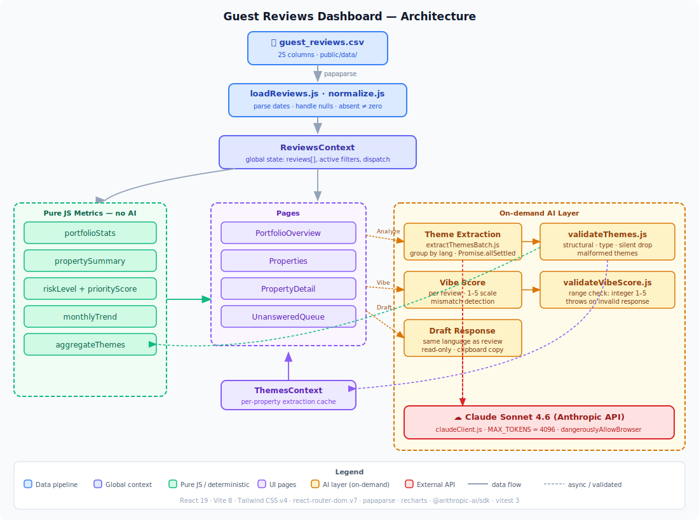

# Guest Reviews Dashboard

A client-side vacation rental reviews dashboard. Ingests a CSV of guest reviews, computes operational metrics deterministically, and augments the view with on-demand AI analysis powered by Claude.

---

## Architecture



---

## Running locally

### 1. Clone the repository

```bash
git clone https://github.com/alejohenaoe/reviews-dashboard.git
cd reviews-dashboard
```

### 2. Install dependencies

```bash
npm install
```

### 3. Set the API key

Create a `.env` file at the project root:

```
VITE_ANTHROPIC_API_KEY=sk-ant-api03-...
```

> The AI features (theme extraction, vibe score, draft response) require a valid Anthropic API key.
> The dashboard loads and all deterministic metrics work without it — AI panels will show an error on first use if the key is missing.

### 4. Start the dev server

```bash
npm run dev
```

Open [http://localhost:5173](http://localhost:5173).

### Other commands

| Command | Purpose |
|---|---|
| `npm run build` | Production build → `dist/` |
| `npm run preview` | Serve the production build locally |
| `npm run lint` | ESLint (flat config) |
| `npm test` | Vitest unit tests |

---

## What's done

### Data & metrics
- CSV ingestion via papaparse, client-side, no backend
- Normalized review schema (dates parsed, nulls handled, missing ratings treated as absent not zero)
- Portfolio KPIs: total reviews, average rating, response rate, unanswered count, property count
- Per-property summary with sub-ratings, response rate, and recent trend
- Risk level classification: `healthy / watch / critical` computed from avg rating + response rate
- Priority score for triage ordering
- Monthly rating trend chart (Recharts)

### Pages
- **Portfolio Overview** — KPI cards, trend chart, portfolio-level AI insights panel
- **Properties** — sortable table with risk badges and priority scores
- **Property Detail** — full review list with per-review vibe score and draft response
- **Unanswered Queue** — filtered view of reviews with no host response, draft response button per item

### AI features (on-demand, never auto-firing)
- **Theme extraction** — groups reviews by language, runs parallel batches via `Promise.allSettled`, validates and sanitizes each response before rendering. Available at property level and portfolio level.
- **Vibe score** — per-review sentiment score on a 1–5 scale (mirrors star ratings), with mismatch detection when text tone disagrees with the numeric rating
- **Draft response** — generates a host reply in the same language as the review; read-only modal with clipboard copy and regenerate

### Tests
- 54 unit tests across 4 files covering metrics (portfolioStats, propertySummary, riskLevel, priorityScore)
- All tests run against pure JS logic with no side effects — no API calls, no file I/O

---

## What was cut and why

| Cut | Reason |
|---|---|
| Persisting AI results across sessions (localStorage / IndexedDB) | Adding persistence requires a cache-invalidation strategy tied to the CSV version — deferred for time |
| Inline vibe score editing / textarea draft editing | AI output is intentionally read-only; the host should review before posting |
| Automatic vibe scoring on page load | Kept lazy (on-demand) to avoid firing unnecessary API calls |
| Local model inference (Transformers.js / WebLLM) | Would eliminate the external API dependency but adds significant bundle size and complexity |
| Multi-CSV / file upload | Single CSV as source of truth per architecture rules |

### Things left behind for time

- **Multilingual handling** — a translation toggle on individual reviews, or a normalized-to-English search so non-English text is searchable with English keywords.
- **Weekly digest card** — a printable/emailable summary the operator can schedule: top 3 things to act on this week, generated from current risk and theme data.
- **Anomaly flag** — a badge on properties whose rolling average dropped >0.5 stars vs their trailing 6-month baseline, surfaced on the Properties table and the detail page.
- **Cost/latency transparency** — a dev overlay (or a section here in the README) showing the estimated token cost per AI call and a projection of what the current feature set would cost at 50,000 reviews/month.

---

## Where AI is used and what guardrails are in place

### Where AI is used
1. **Theme extraction** (`src/ai/extractThemesBatch.js` + `src/ai/prompts.js`) — Claude extracts recurring themes from review text grouped by language
2. **Vibe score** (`src/components/ai/VibeScore.jsx`) — per-review sentiment on a 1–5 scale
3. **Draft response** (`src/components/ai/DraftResponseModal.jsx`) — suggested host reply

### Guardrails
- **All AI output is validated before rendering.** `validateThemes.js` and `validateVibeScore.js` check structure, types, and value ranges. Malformed themes are silently dropped; structurally invalid responses throw and show an error state.
- **AI never produces business metrics.** Averages, response rates, risk levels, and priority scores are computed in pure JS from the CSV. AI only does semantic work (which reviews belong to a theme, what the tone is).
- **Batch errors are non-fatal.** `Promise.allSettled` means one failing language batch does not block others. Errors surface with per-language detail in the UI.
- **On-demand only.** No AI call fires on page load. Every call requires explicit user action.
- **Review text is not translated before analysis.** Claude receives original language text; canonical theme names are English.
- **Max 100 reviews per language batch.** Prevents oversized prompts and limits data sent per call.
- **`MAX_TOKENS = 4096`** — large enough for complete JSON responses, avoiding truncation-induced parse failures.

### Data sent to Anthropic
Only `index`, `language`, `rating`, and `review_text` are sent per review. No guest names, booking details, or other columns are included in AI prompts.

> Review text is sent to a third-party API. The current design mitigates this by batching (max 100/language), limiting the fields sent, and gating every call on explicit user action.

---

## Known issues and next-polish items

- **AI results are not persisted.** Closing and reopening the property detail page clears the extracted themes. A session-scoped cache (localStorage keyed by property ID + CSV hash) would fix this.
- **Vibe score `count` comes from Claude.** The theme `count` field (how many reviews support a theme) is a semantic judgment by Claude, not a deterministic count. It is used only for ranking, never as a displayed business KPI, but a stricter implementation would recount by matching `reviewIndices` against the input batch in JS.
- **API key is in the browser.** `dangerouslyAllowBrowser: true` is required for client-side Anthropic calls. A thin proxy (Cloudflare Worker, Vercel Edge Function) would keep the key server-side.
- **No pagination on review lists.** Properties with many reviews render all cards at once. Virtualisation (e.g. `react-virtual`) would improve performance.
- **Portfolio insights re-run on every click.** There is no diff-detection to skip re-analysis when the data hasn't changed since last run.

---

## With an extra day

- The highest-leverage addition would be embedding reviews into a local vector database.

- **Multilingual handling** — a translation toggle on individual reviews, or a normalized-to-English search so non-English text is searchable with English keywords.
- **Weekly digest card** — a printable/emailable summary the operator can send themselves: top 3 things to act on this week, generated from current risk scores and theme data.
- **Anomaly flag** — a badge on properties whose rolling average dropped >0.5 stars vs their trailing 6-month baseline, surfaced on the Properties table and the detail page.
- **Cost/latency transparency** — show (in the UI or here) the estimated token cost per AI call and a projection of what the current feature set would cost at 50,000 reviews/month.


